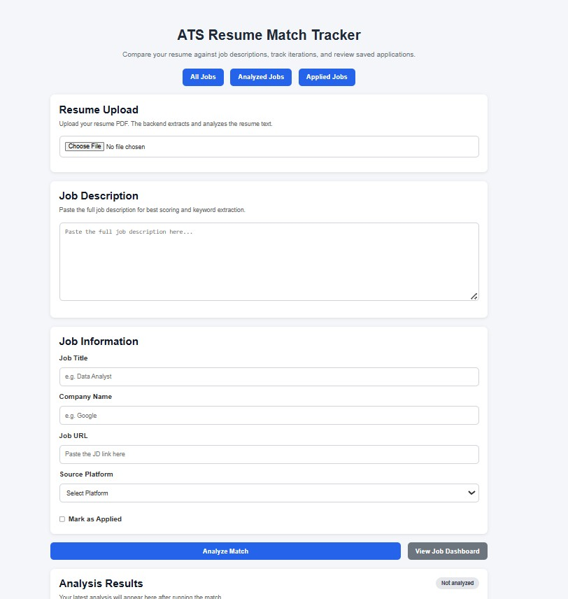
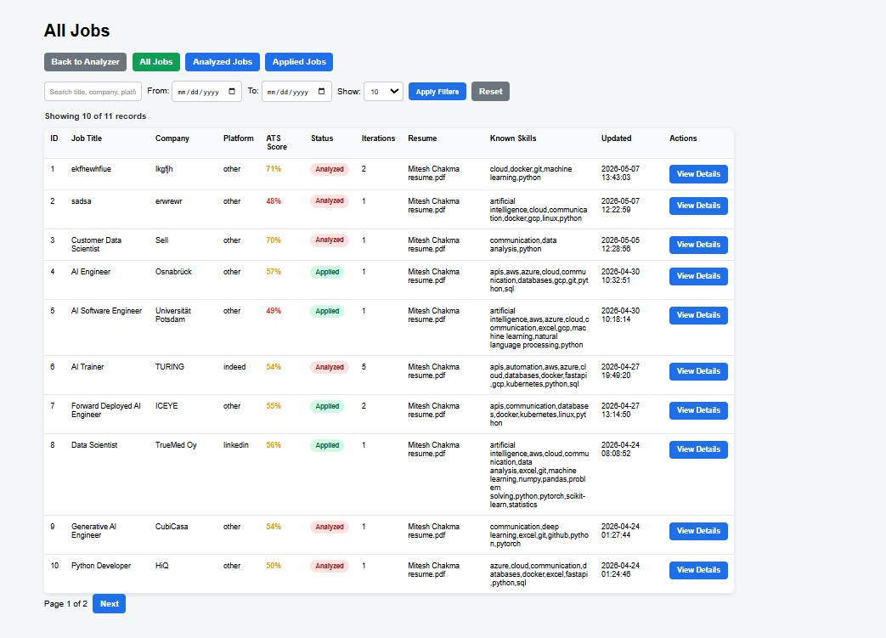
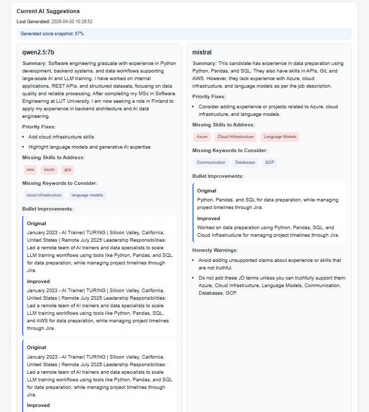

# ATS Resume Match Tracker

A candidate-side ATS simulation and resume optimization tool built with Flask, SQLite, SQLAlchemy, and local LLMs.

This project helps job seekers compare a resume against a specific job description, calculate an ATS-style match score, track analyzed/applied jobs, and generate truthful AI improvement suggestions before applying.

## What This Project Does

This is not a full company-side Applicant Tracking System.

It is a candidate-side ATS simulation tool that helps answer:

- How well does my resume match this job description?
- Which skills are matched or missing?
- Which job-description keywords are missing?
- Does my experience and role level align with the job?
- How can I improve my resume truthfully before applying?
- Which jobs have I analyzed or already applied to?

## Key Features

- Resume upload and text extraction from PDF
- Job description parsing
- Resume parsing
- ATS-style scoring
- Matched and missing skill detection
- Candidate keyword extraction
- Experience and role-level comparison
- SQLite persistence with SQLAlchemy
- Job deduplication using resume filename + job URL
- Iteration tracking
- Applied-job locking
- Analyzed jobs dashboard
- Applied jobs dashboard
- Dynamic table filters, pagination, date range filtering
- Job detail page
- Saved job description preview with show more / show less
- Local LLM-based improvement suggestions
- Dual-model suggestion generation with Ollama
- Frozen suggestion snapshot when a job is marked as applied

## Tech Stack

- Python
- Flask
- SQLite
- SQLAlchemy
- HTML
- CSS
- JavaScript
- Ollama
- Local LLMs:
  - Qwen
  - Mistral

## Project Structure

```text
ats-hybrid-engine/
│
├── app.py
├── config.py
├── requirements.txt
├── .gitignore
├── README.md
│
├── database/
│   ├── db.py
│   └── models.py
│
├── services/
│   ├── jd_parser.py
│   ├── resume_parser.py
│   ├── resume_extractor.py
│   ├── resume_normalizer.py
│   ├── scorer.py
│   └── llm_suggester.py
│
├── static/
│   ├── app.js
│   └── style.css
│
├── templates/
│   ├── index.html
│   ├── jobs.html
│   └── job_detail.html
│
├── data/
│   └── skills_db.json
│
└── instance/
    └── ats_tracker.db

````markdown
## How the Scoring Works

The ATS score is calculated from multiple explainable components:

- **Skills score**
- **Candidate keyword score**
- **Experience score**
- **Role-level score**

The purpose is not only to generate a score, but to explain **why** the resume is strong or weak for a specific job.

The scoring is **deterministic**. Local LLMs are used only for suggestions, not for the actual scoring logic.

---

## Local LLM Suggestions

The system uses **Ollama** to run local models.

### Current model setup

```python
MODEL_A_NAME = "qwen2.5:7b"
MODEL_B_NAME = "mistral"
````

* **Qwen** is used as the detailed rewrite engine.
* **Mistral** is used as a lightweight second-opinion engine.

Suggestions can be regenerated freely before applying.

When a job is marked as **applied**, the current suggestions are frozen and saved permanently with that job record.

---

## Setup Instructions

### 1. Clone the repository

```bash
git clone https://github.com/MiteshChakma/ats-resume-match-tracker.git
cd ats-resume-match-tracker
```

### 2. Create virtual environment

**Windows**

```bash
python -m venv venv
venv\Scripts\activate
```

**macOS/Linux**

```bash
python3 -m venv venv
source venv/bin/activate
```

### 3. Install dependencies

```bash
pip install -r requirements.txt
```

### 4. Install Ollama

Download and install Ollama:

[https://ollama.com](https://ollama.com)

Then pull the local models:

```bash
ollama pull qwen2.5:7b
ollama pull mistral
```

### 5. Run the Flask app

```bash
python app.py
```

Open in browser:

```text
http://127.0.0.1:5000
```

---

## Main Routes

| Route            | Description                      |
| ---------------- | -------------------------------- |
| `/`              | Main analyzer page               |
| `/analyze`       | Analyze resume + job description |
| `/history`       | JSON history endpoint            |
| `/debug/db`      | Debug database output            |
| `/jobs`          | All jobs dashboard               |
| `/jobs/analyzed` | Analyzed jobs dashboard          |
| `/jobs/applied`  | Applied jobs dashboard           |
| `/jobs/<id>`     | Job detail page                  |

---

## Current Limitations

* PDF extraction can lose text if the resume uses complex layouts.
* Candidate keyword matching is still mostly exact-match based.
* Semantic keyword matching is not fully implemented yet.
* SQLite schema changes currently require manual migration or database reset.
* Local LLM output quality depends on installed models and available hardware.
* The project is currently designed for local development.

---

## Planned Improvements

* Add Flask-Migrate for database migrations
* Improve PDF and DOCX extraction
* Add semantic keyword matching
* Add synonym matching for related skills
* Add authentication
* Add exportable reports
* Add better resume section detection
* Add confidence scoring for LLM suggestions
* Deploy to cloud with PostgreSQL

```

# Screenshots

## Home Dashboard





